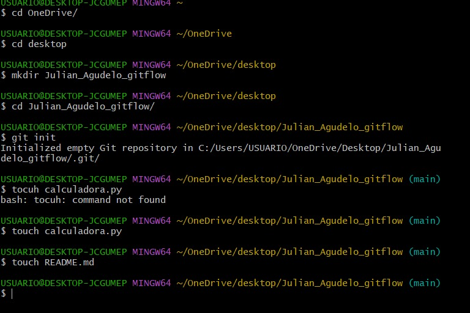
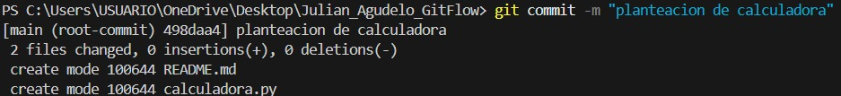
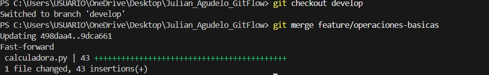
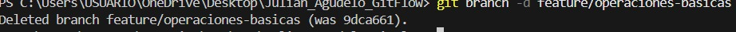
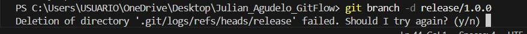
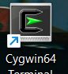
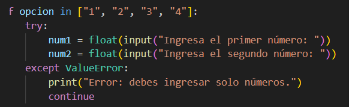
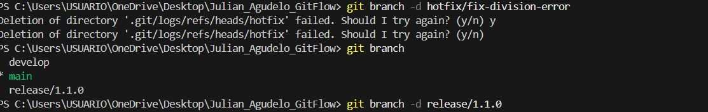
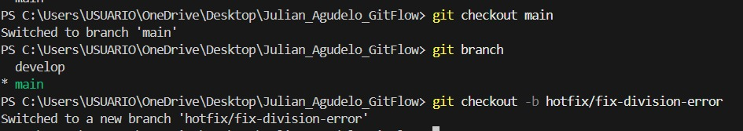
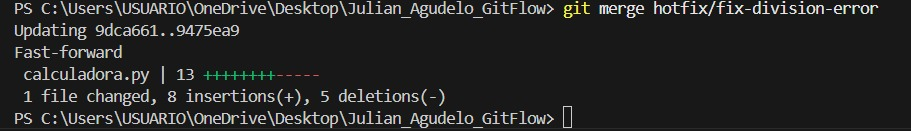

# 🧮 Calculadora en Python - Flujo Completo con Git Flow

## - Descripción

Este proyecto consiste en el desarrollo de una calculadora básica en Python aplicando buenas prácticas de control de versiones con Git y Git Flow.

El objetivo no fue solo desarrollar la calculadora, sino también implementar un flujo profesional de trabajo similar al utilizado en equipos reales de desarrollo.

---

## - Objetivos del Proyecto

- Desarrollar una calculadora funcional en Python.
- Implementar manejo de errores con `try/except`.
- Aplicar Git Flow para organizar el desarrollo.
- Crear versiones (release).
- Implementar hotfix para corregir errores en producción.
- Publicar el proyecto en GitHub.

---

## - Tecnologías Utilizadas

- Python
- Git
- Git Flow
- GitHub

---

##  Proceso de Desarrollo

### - Inicialización del Proyecto

Se inicializó el repositorio, se creo el archivo python y el readme

### - Se creo primer commit desde la rama main 

Se realizo commit con rama main con tal de darle inicializacion al programa calculadora 

### - se aplico git flow creando rama develop y feature para empezar el codigo desde rama feature

aqui en esa parte ya se habia echo todo el codigo desde rama feature, se probo y se hizo commit desde conventional commit para ser enviada despues a develop para poder dar por terminada la rama feature.

### - se creo rama release para revision y no se encontraron errores y se envio como version 1.0.0 con commit.

despues de crear rama release con gitflow en develop y haberse enviado a develop para poder terminar la rama release y seguir con el proceso.

se elimino desde la terminal de vscode porq al momento de hacerlo desde la terminal instalada siempre me salia error y decidi hacerlo manual.

### - Se creo rama hoxfix para revision errores al ejecutarlo.

se encontro que al momento que la persona usara calucladora y escribiera una letra por ejemplo, el programa se bugea y no deja intentarlo otra vez y se creo una excepcion para ese tipo de error.

### - Se finalizo hoxfix y fue enviado a rama main para dar por finalizado el programa sin errores.

En esta seccion se hizo el merge en main. 

y seda por finalizado el programa y se hace push a
repositorio en github y dar por finalizada la tarea.

